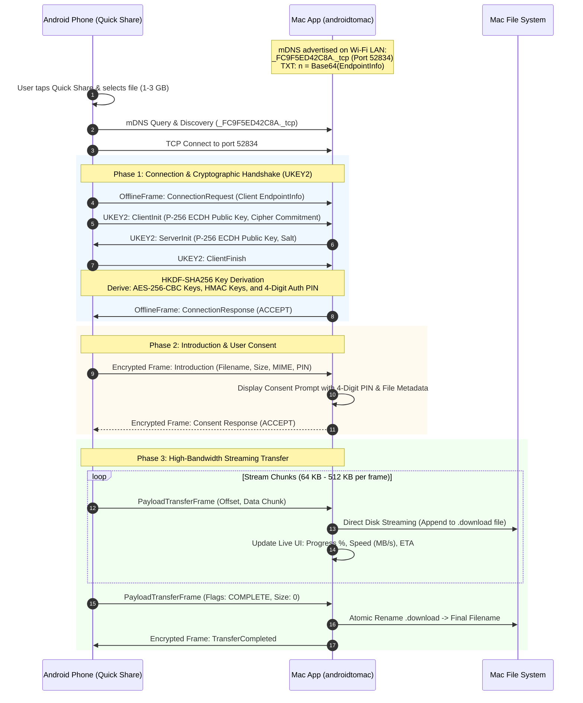

# Android Quick Share to macOS: System Requirements & High-Bandwidth Test Specification

**Project**: `androidtomac`  
**Repository**: `https://github.com/cadarsh88/androidtomac.git`  
**Project Directory**: `/Documents/Git/cadarsh88/androidtomac` (full path: `/Users/adarshc/Documents/Git/cadarsh88/androidtomac`)  
**Target Platform**: macOS 13.0+ (Ventura, Sonoma, Sequoia)  
**Supported Peers**: Android 10+ devices running Google Quick Share (formerly Nearby Share)  
**Target Transfer Profile**: 1 GB – 3 GB files at maximum local Wi-Fi bandwidth with minimal latency  

---

## 1. Executive Summary & Problem Statement

Android devices utilize Google's **Quick Share** (formerly *Nearby Share*) protocol to discover and transfer files between peers at high speeds. While Android-to-Android and Android-to-Windows have native Quick Share implementations, macOS lacks official Quick Share support, forcing users to rely on slow cloud uploads, messaging apps, or third-party web portals.

This project delivers a **native macOS Menu Bar application** that acts as an authentic Quick Share receiver (and sender). It leverages local Wi-Fi LAN multicast DNS (mDNS / Bonjour) for instant discovery, executes an end-to-end encrypted UKEY2 cryptographic handshake, and opens a high-throughput raw TCP connection to transfer files ranging from megabytes up to multiple gigabytes (1 GB – 3 GB+) at line rate (60–120+ MB/s on 5 GHz / Wi-Fi 6) without latency or memory bloat.

---

## 2. System Architecture & Protocol Specification



### 2.1 Protocol Parameters & Constants
* **Service Type**: `_FC9F5ED42C8A._tcp.local.`
  * Derived from: `SHA256("NearbySharing")[0..<6]` formatted as hex = `FC9F5ED42C8A`.
* **Endpoint ID**: 4-character random alphanumeric string (e.g. `k8R2`).
* **Service Name**: URL-safe Base64 encoded 10 bytes:
  * Byte 0: `0x23` (PCP identifier)
  * Bytes 1-4: Endpoint ID (4 ASCII bytes)
  * Bytes 5-7: Service ID prefix `[0xFC, 0x9F, 0x5E]`
  * Bytes 8-9: Reserved zeroes `[0x00, 0x00]`
* **Endpoint Info TXT Record (`n`)**:
  * Byte 0: Bit field `(DeviceType << 1) | (Visibility << 4) | Version` (DeviceType: `3` for Laptop/Desktop; Visibility: `0` for Visible).
  * Bytes 1-16: 16 random salt / metadata key bytes.
  * Byte 17: Length of UTF-8 device name ($L$).
  * Bytes 18 to $18+L-1$: Device Name (e.g., "Adarsh's MacBook Pro").
* **UKEY2 Key Agreement**:
  * Elliptic Curve: NIST P-256 (`secp256r1`).
  * KDF: HKDF with SHA-256.
  * Symmetric Cipher: AES-256 in CBC mode with PKCS#7 padding (or AES-256-GCM where supported).
  * Message Authentication: HMAC-SHA256.
  * PIN Code Derivation: First 4 digits derived from `HKDF-SHA256(authKey, info="NearbySharingPIN")` converted to integer modulo 10000.

---

## 3. Functional Requirements (FR)

| ID | Requirement | Description | Priority |
| :--- | :--- | :--- | :--- |
| **FR-01** | **mDNS Receiver Beacon** | App must publish an mDNS Bonjour service `_FC9F5ED42C8A._tcp` with valid TXT record `n` so any Android device opening Quick Share immediately discovers the Mac. | P0 |
| **FR-02** | **UKEY2 Mutual Handshake** | Complete the 3-step UKEY2 key exchange with Android client, verify ephemeral public keys, and derive identical session encryption keys. | P0 |
| **FR-03** | **4-Digit PIN Authentication** | Compute and display the identical 4-digit verification PIN shown on the Android screen to prevent Man-in-the-Middle (MitM) attacks. | P0 |
| **FR-04** | **Consent Authorization Modal** | When an Android device requests a transfer, display an alert/modal showing sender name, device model, file names, file sizes, and PIN code with Accept/Decline actions. | P0 |
| **FR-05** | **High-Throughput File Streaming** | Stream chunks directly from the decrypted TCP stream into disk storage without loading whole files into memory. | P0 |
| **FR-06** | **Large File Support (1 GB – 3 GB+)** | Flawlessly receive files of 1 GB, 2 GB, 3 GB, or larger without timeouts, dropped frames, or memory exhaustion. | P0 |
| **FR-07** | **Real-Time Transfer Telemetry** | UI must display real-time progress bar, transferred / total bytes (e.g. `1.85 GB / 3.00 GB`), current speed (`82.4 MB/s`), and estimated time remaining (ETA). | P1 |
| **FR-08** | **Atomic File Finalization** | Stream incoming data into a `.download` temporary file. Only upon receiving the final complete chunk and verifying byte count, atomically rename to the target file in `~/Downloads`. | P1 |
| **FR-09** | **Filename Collision Handling** | If a file with the same name already exists in the destination folder, automatically append an incremental counter (e.g., `Video (1).mp4`). | P1 |
| **FR-10** | **Batch Multiple Files Transfer** | Support receiving bundles containing multiple files (e.g., 50 photos totaling 2 GB) in a single transfer session. | P1 |
| **FR-11** | **Cancellation Handling** | Gracefully abort and cleanup partial files if either the Android sender cancels, the Mac user cancels, or the Wi-Fi connection breaks. | P1 |
| **FR-12** | **Menu Bar Status & Transfer History** | Resident Menu Bar icon indicating standby, active transfer, and past transfer logs with "Show in Finder" shortcuts. | P2 |
| **FR-13** | **QR Code Pairing Support** | Generate and display Quick Share QR code (`https://quickshare.google/qrcode#key=...`) to trigger instant discovery even when background BLE beaconing is restricted by macOS. | P2 |

---

## 4. Non-Functional Requirements & 1-3 GB Transfer Performance

### 4.1 Throughput & Latency (NFR-01)
* **Initial Connection Latency**: Discovery to consent prompt must complete within **< 1.5 seconds**.
* **Wi-Fi Throughput**:
  * Over 5 GHz 802.11ac: Sustained **40 – 70 MB/s** (320 – 560 Mbps).
  * Over 5 GHz / 6 GHz 802.11ax (Wi-Fi 6 / 6E): Sustained **80 – 130 MB/s** (640 – 1040 Mbps).
* **Transfer Duration Benchmarks**:
  * **1 GB File**: $\le 12 - 18$ seconds on 5 GHz Wi-Fi.
  * **3 GB File**: $\le 35 - 50$ seconds on 5 GHz Wi-Fi.

### 4.2 Memory & Resource Footprint (NFR-02)
* **Resident Memory (RSS)**: Must remain **under 50 MB** during an active 3 GB transfer.
* **Zero-Copy Disk Buffering**: Stream chunks directly into disk buffers (`write` / `FileHandle`). Under no circumstances should payload chunks accumulate in RAM arrays.
* **CPU Utilization**: Less than 15% on Apple Silicon during active 100 MB/s transfer, leveraging hardware-accelerated AES via Apple's CommonCrypto / CryptoKit.

### 4.3 Network & Socket Optimization for High Bandwidth (NFR-03)
* **TCP Receive Window (`SO_RCVBUF`)**: Set TCP receive buffer to at least **2 MB - 4 MB** to maximize bandwidth-delay product (BDP) over Wi-Fi.
* **TCP No Delay (`TCP_NODELAY`)**: Enabled for control messages to eliminate Nagle's algorithm latency; optimized streaming for chunk payloads.
* **Backpressure Management**: Decouple network receiving and disk writing via a dedicated serial I/O dispatch queue with high watermarks to prevent socket stalls.

### 4.4 Sleep & Power Management (NFR-04)
* The app must declare an `IOPMAssertionCreateWithName` (`kIOPMAssertionTypePreventUserIdleSystemSleep`) power assertion while a transfer is in progress to prevent macOS from sleeping mid-transfer during 3 GB transfers.

---

## 5. Test Suite & Verification Matrix (Focus on 1–3 GB Payloads)

### 5.1 Test Environment Specification
* **Receiver Device**: Mac running macOS 13+ (Apple Silicon M-series or Intel), connected to 5 GHz Wi-Fi (Channel width: 80 MHz or 160 MHz).
* **Sender Device**: Android smartphone (Samsung Galaxy S21/S22/S23/S24, Google Pixel 6/7/8/9, or OnePlus) with Quick Share enabled, connected to the same 5 GHz Wi-Fi SSID.
* **Test Payloads**:
  * Payload A: `sample_small.jpg` (5 MB)
  * Payload B: `video_medium.mp4` (1.00 GB / 1,073,741,824 bytes)
  * Payload C: `archive_large.zip` (3.00 GB / 3,221,225,472 bytes)
  * Payload D: Batch of 100 mixed media files totaling 2.5 GB.

### 5.2 Detailed Test Cases

```
+----------------------------------------------------------------------------------------------------+
| Test Case ID: TC-01                                                                                |
| Title: mDNS Receiver Discovery on Shared Wi-Fi                                                    |
| Objective: Verify that Android Quick Share discovers the Mac receiver within 2 seconds.           |
| Pre-conditions: Mac app is running; Android and Mac are on the same Wi-Fi SSID.                   |
| Steps:                                                                                             |
|   1. Open any photo or file in Google Photos / Files on Android.                                   |
|   2. Tap 'Share' -> 'Quick Share'.                                                                 |
|   3. Observe available target devices.                                                             |
| Expected Result: Mac device appears with configured icon and device name in < 2 seconds.          |
+----------------------------------------------------------------------------------------------------+

+----------------------------------------------------------------------------------------------------+
| Test Case ID: TC-02                                                                                |
| Title: UKEY2 Handshake & 4-Digit PIN Generation Accuracy                                           |
| Objective: Ensure ECDH key agreement succeeds and identical 4-digit PIN is displayed.             |
| Pre-conditions: TC-01 passed.                                                                      |
| Steps:                                                                                             |
|   1. Tap the Mac icon on the Android Quick Share sheet.                                            |
|   2. Inspect the 4-digit PIN displayed on Android screen.                                          |
|   3. Inspect the 4-digit PIN displayed on Mac consent prompt.                                      |
| Expected Result: Both PINs match exactly (e.g., "7294"). Handshake completes in < 500ms.          |
+----------------------------------------------------------------------------------------------------+

+----------------------------------------------------------------------------------------------------+
| Test Case ID: TC-03                                                                                |
| Title: User Consent Authorization Flow (Accept / Decline)                                         |
| Objective: Validate transfer begins only when authorized and terminates immediately when declined. |
| Steps:                                                                                             |
|   Case A: Click "Decline" -> Connection closes, Android displays "Declined", no files saved.       |
|   Case B: Click "Accept" -> Socket transitions to STREAMING, file creation begins.                 |
| Expected Result: Both branches execute cleanly without orphaned sockets or memory leaks.          |
+----------------------------------------------------------------------------------------------------+

+----------------------------------------------------------------------------------------------------+
| Test Case ID: TC-04                                                                                |
| Title: 1 GB High-Bandwidth Data Transfer Verification                                              |
| Objective: Verify 1.00 GB file transfers at line rate with zero corruption.                       |
| Test File: 1.00 GB (1,073,741,824 bytes), pre-computed SHA-256 checksum recorded.                |
| Steps:                                                                                             |
|   1. Select 1 GB test file on Android and send to Mac.                                             |
|   2. Accept transfer on Mac.                                                                       |
|   3. Record transfer time, average speed (MB/s), and memory usage during transfer.                |
|   4. Verify final file SHA-256 checksum on Mac against Android source.                             |
| Pass Criteria:                                                                                     |
|   - Transfer time: <= 18 seconds (Average speed >= 60 MB/s on 5 GHz Wi-Fi).                        |
|   - Checksum matches 100% (Bit-perfect integrity).                                                 |
|   - Max App RAM usage: <= 50 MB.                                                                   |
+----------------------------------------------------------------------------------------------------+

+----------------------------------------------------------------------------------------------------+
| Test Case ID: TC-05                                                                                |
| Title: 3 GB Stress Test & Zero-Leak Streaming Verification                                         |
| Objective: Verify 3.00 GB file transfer without socket drop, thermal throttle, or memory bloat.  |
| Test File: 3.00 GB (3,221,225,472 bytes), pre-computed SHA-256 checksum recorded.                |
| Steps:                                                                                             |
|   1. Send 3 GB archive from Android to Mac.                                                        |
|   2. Accept transfer on Mac.                                                                       |
|   3. Continuously sample macOS Activity Monitor (Memory RSS and CPU %).                           |
|   4. Verify atomic file rename upon completion.                                                    |
|   5. Execute `shasum -a 256` on the received file.                                                 |
| Pass Criteria:                                                                                     |
|   - Transfer time: <= 50 seconds (Average speed >= 65 MB/s).                                       |
|   - Memory RSS remains flat (< 50 MB, no monotonic memory climb).                                  |
|   - SHA-256 checksum matches source file exactly.                                                  |
|   - Temporary `.download` file is cleanly replaced by final file.                                  |
+----------------------------------------------------------------------------------------------------+

+----------------------------------------------------------------------------------------------------+
| Test Case ID: TC-06                                                                                |
| Title: Mid-Transfer Sender Cancellation (Android Abort)                                           |
| Objective: Ensure partial files are purged if Android cancels at 50% of 2 GB transfer.             |
| Steps:                                                                                             |
|   1. Begin sending a 2 GB file. At 1 GB (50%), tap "Cancel" on Android.                            |
| Expected Result: Mac receives cancellation frame, immediately halts I/O, deletes partial file,    |
|                  and resets state to listening. No orphaned .download file remains in Downloads.   |
+----------------------------------------------------------------------------------------------------+

+----------------------------------------------------------------------------------------------------+
| Test Case ID: TC-07                                                                                |
| Title: Mid-Transfer Receiver Cancellation (Mac Abort)                                              |
| Objective: Ensure sender receives cancel notification if Mac user clicks "Cancel".                |
| Steps:                                                                                             |
|   1. Begin sending 2 GB file. At 50%, click "Cancel" in Mac transfer window.                       |
| Expected Result: Android UI instantly displays "Canceled by receiver". Partial file is purged.     |
+----------------------------------------------------------------------------------------------------+

+----------------------------------------------------------------------------------------------------+
| Test Case ID: TC-08                                                                                |
| Title: Sudden Wi-Fi Disconnection / Link Loss Resilience                                           |
| Objective: Verify socket timeout and cleanup if Wi-Fi link drops during 3 GB transfer.             |
| Steps:                                                                                             |
|   1. During active transfer, toggle Wi-Fi OFF on Android or Mac.                                   |
| Expected Result: Mac socket detects connection failure, cleans up temporary resources, and         |
|                  notifies user. Upon Wi-Fi reconnection, mDNS service recovers automatically.       |
+----------------------------------------------------------------------------------------------------+

+----------------------------------------------------------------------------------------------------+
| Test Case ID: TC-09                                                                                |
| Title: Multiple Batch Transfer (100 Files totaling 2.5 GB)                                         |
| Objective: Verify sequence handling and file handle closure across multiple sequential files.      |
| Steps:                                                                                             |
|   1. Select 100 photos/videos on Android and send as one batch.                                    |
| Expected Result: All 100 files are created, written, closed, and verified without file descriptor  |
|                  exhaustion (`EMFILE` error). Total bytes received matches exactly.                |
+----------------------------------------------------------------------------------------------------+

+----------------------------------------------------------------------------------------------------+
| Test Case ID: TC-10                                                                                |
| Title: System Sleep Prevention (IOPMAssertion)                                                     |
| Objective: Confirm Mac does not enter idle sleep during an extended 3 GB file transfer.            |
| Steps:                                                                                             |
|   1. Set Mac Display & System sleep timer to 1 minute in System Settings.                          |
|   2. Initiate 3 GB transfer (takes ~45 seconds) without touching trackpad/keyboard.                |
| Expected Result: Mac remains awake for the entire duration; assertion released upon completion.    |
+----------------------------------------------------------------------------------------------------+
```

---

## 6. Development & Deployment Roadmap

1. **Phase 1: Foundation & Git Setup**
   - Initialize git tracking against `https://github.com/cadarsh88/androidtomac.git`.
   - Project directory: `/Users/adarshc/Documents/Git/cadarsh88/androidtomac`.
2. **Phase 2: Protobuf & Cryptography Engine**
   - Generate Swift classes for Google Nearby Sharing & UKEY2 protobuf specifications.
   - Implement UKEY2 ECDH (NIST P-256), HKDF-SHA256, AES-256-CBC, and HMAC-SHA256.
3. **Phase 3: mDNS Discovery & Network Listener**
   - Bonjour service registration for `_FC9F5ED42C8A._tcp`.
   - EndpointInfo packing and URL-safe Base64 TXT record publishing.
   - High-performance `NWListener` TCP socket listener.
4. **Phase 4: High-Performance Disk Streamer**
   - Low-latency chunk receiver with 1–4 MB socket window tuning.
   - Direct POSIX / `FileHandle` streaming to temporary download files.
   - Atomic rename and integrity verification.
5. **Phase 5: User Interface & Menu Bar Integration**
   - Native macOS Menu Bar item (`NSStatusItem`).
   - Swift UI consent sheet with PIN code and file list.
   - Live telemetry dashboard (progress bar, transfer speed in MB/s, ETA, cancel action).
6. **Phase 6: Synthetic & Live Testing**
   - Automated synthetic test harness for 1 GB and 3 GB payloads.
   - Live validation with Android Quick Share.
   - Git push to `https://github.com/cadarsh88/androidtomac.git`.
